# Facts And Glitches
This compiles all the possible facts and glitches I and a lot of people across mutliple years found for this game.

# Contents
- [Facts And Glitches](#facts-and-glitches)
- [Contents](#contents)
- [General Facts](#general-facts)
  - [Evo VII Rally’s Broken Gears](#evo-vii-rallys-broken-gears)
  - [JGTC ESSO SUPRA Livery Change](#jgtc-esso-supra-livery-change)
  - [Removed Cars And Brands](#removed-cars-and-brands)
  - [TCS + ESC Screen](#tcs--esc-screen)
  - [CAR IS STUCK text](#car-is-stuck-text)
  - [Game Builds Dates](#game-builds-dates)
  - [Unused Maps](#unused-maps)
  - [Ranking Points](#ranking-points)
  - [Drag Race](#drag-race)
  - [Ocean Bridge Illusion](#ocean-bridge-illusion)
  - [Official Playstation Magazine US](#official-playstation-magazine-us)
  - [Different VGS Versions](#different-vgs-versions)
  - [Different Game Version](#different-game-version)
  - [Game’s Tagline](#games-tagline)
  - [Interesting Filter Option](#interesting-filter-option)
  - [Hour filter in Sector Times](#hour-filter-in-sector-times)
  - [Interesting AI Behavior](#interesting-ai-behavior)
  - [Out Of Bounds Experience](#out-of-bounds-experience)
  - [Dirt / Snow on Cars](#dirt--snow-on-cars)
  - [Black Flag behaviour](#black-flag-behaviour)
  - [CD Projekt Distribution](#cd-projekt-distribution)
  - [ENTHU POINTS](#enthu-points)
  - [Active Aero](#active-aero)
  - [Rotary Engine Chime](#rotary-engine-chime)
  - [First Gen Prius Pedestrian Warning](#first-gen-prius-pedestrian-warning)
  - [Advanced AI](#advanced-ai)
  - [Suspension Travel](#suspension-travel)
  - [Speedometer Reading](#speedometer-reading)
  - [Car Paints](#car-paints)
  - [Mirage’s Track Randomization](#mirages-track-randomization)
  - [Engine Simulation](#engine-simulation)
  - [Driver Weight](#driver-weight)
  - [Japanese Text in US Build](#japanese-text-in-us-build)
  - [Hybrid Car Cruise Assist](#hybrid-car-cruise-assist)
- [Archive Facts](#archive-facts)
  - [Game Builds](#game-builds)
    - [Official Playstation Magazine DEMO Disk](#official-playstation-magazine-demo-disk)
      - [From Internal Code](#from-internal-code)
    - [Japan Trial Demo](#japan-trial-demo)
    - [US Demo](#us-demo)
    - [EU Demo](#eu-demo)
    - [Italian Demo](#italian-demo)
    - [SUBARU Impreza WRX STI Trial Version](#subaru-impreza-wrx-sti-trial-version)
    - [January 3rd 2005 Prototype](#january-3rd-2005-prototype)
    - [January 16th 2005 Prototype](#january-16th-2005-prototype)
    - [Enthusia US Retail Build](#enthusia-us-retail-build)
    - [Enthusia JP Retail Build](#enthusia-jp-retail-build)
    - [Enthusia EU Retail Build](#enthusia-eu-retail-build)
    - [Konami Dendou Release](#konami-dendou-release)
    - [Unknown Builds](#unknown-builds)
      - [E3 2004 Build](#e3-2004-build)
      - [Tokyo Games Show Build](#tokyo-games-show-build)
  - [Unused Dev Comments](#unused-dev-comments)
  - [Unused Concept GUI](#unused-concept-gui)
  - [Unused Speedometer / Tachometer Concepts](#unused-speedometer--tachometer-concepts)
  - [Unused Graphics and Speculated Demo Versions](#unused-graphics-and-speculated-demo-versions)
  - [Debug Car](#debug-car)
  - [VGS Patent](#vgs-patent)
  - [Save File Transfer](#save-file-transfer)
  - [B Spec in Enthusia](#b-spec-in-enthusia)
  - [Removed "PRIZE RACE" Mode](#removed-prize-race-mode)
  - [Removed "Championships"](#removed-championships)
  - [Removed Enthusia Life Features](#removed-enthusia-life-features)
  - [Removed And Changed Maps](#removed-and-changed-maps)
- [Map Facts](#map-facts)
  - [Rev City](#rev-city)
  - [Route de La Seine](#route-de-la-seine)
  - [Burgerschlucht](#burgerschlucht)
  - [Nurburgring Nordschleife](#nurburgring-nordschleife)
  - [Airport Square](#airport-square)
- [Other Things](#other-things)
  - [Interesting Strings](#interesting-strings)
- [Web Archive Things](#web-archive-things)
  - [Original Game Teaser](#original-game-teaser)
  - [Tokyo Auto Salon](#tokyo-auto-salon)
  - [Original Game Guide](#original-game-guide)
  - [Team GOH’s Audi R8 ingame](#team-gohs-audi-r8-ingame)
  - [Enthusia’s Sequel](#enthusias-sequel)
  - [E3 2004 Showcase](#e3-2004-showcase)
  - [Enthusia Marketing Articles](#enthusia-marketing-articles)
  - [Popularity Among Japanese People](#popularity-among-japanese-people)
    - [Rally Championships](#rally-championships)
    - [Time Trials](#time-trials)
      - [QZoTube](#qzotube)

# General Facts
These are general facts about the game.

## Evo VII Rally’s Broken Gears
This is more of a bug, but when you select the “Evo VII Rally” car from the menu and see it’s specs, you see that it has a “5 Speed” gearbox, which makes sense, but selecting the car in Manual and going in a race, you see that you can shift up to a 6th gear, but the 6th gear is totally unusable as it does not do anything, no production of power, and acts more like a neutral.

This works as early as the demo builds of the game and seems to work in all regions of the game.

## JGTC ESSO SUPRA Livery Change
In the US version of the game, the ESSO Supra race car is actually an EXXON Superflo Supra, while in the JP version, the car is the ESSO Ultraflo Supra.

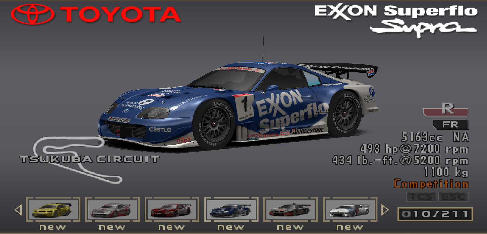
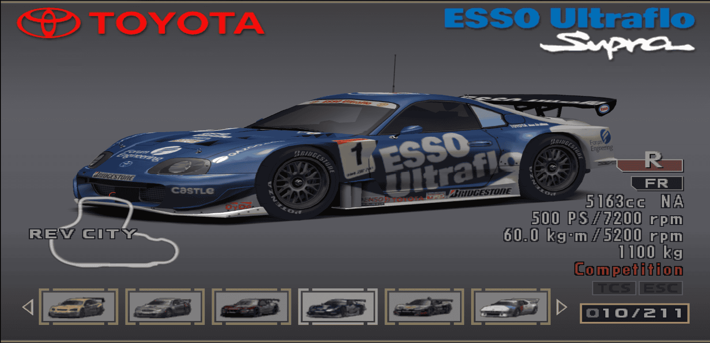

## Removed Cars And Brands
In several versions of the game, most importantly, the Official Playstation Magazine US and Playstation 2 Magazine demo release and Japanese trial release of the game, there are mentions of several cars in the game string files, but does not actually appear in the final game. 

They seems to be a leftover text of the car that was supposed to appear, but was cut from development. 

From the OPM Demo of Enthusia, some more removed cars were found
- `フェラーリ Ｆ４０` = `Ferrari F40`
- `フェラーリ ３６０モデナ` = `Ferrari 360 modena`
- `ベントレー コンチネンタルＧＴ` = `BENTLEY Continental GT`
- `BUGATTI ＥＢ１１０ GT` = `BUGATTI EB110 GT` (technically is there as a Dauer)

Also in terms of brand
- `アキュラ` = `Acura`
- `いすゞ` = `ISUZU`
- `フェラーリ` = `Ferrari`
- `ブガッティ` = `Bugatti` (basically Dauer in final game)
- `ベントレー` = `Bentley`
- `マクラーレン` = `Mclaren` (we believe they mean the `BMW Mclaren F1 Race Car`, which in final game is referred by `BMW`)
- `マセラッティ` = `Maserati` (probably depreciated faster than the game died)
- `ポルシェ` = `Porsche`

For example, there also seems to be an unused “W” Engine in the game that has not been used, which would be perfect for a `Bentley`

A retail copy car list is available at [car_detail.md document](car_detail.md)

## TCS + ESC Screen
In the Japanese version and PAL version of the game, there is always a screen that pops up for TCS and ESC settings as soon as you start the game, which is not at all present in the US Release of the game.

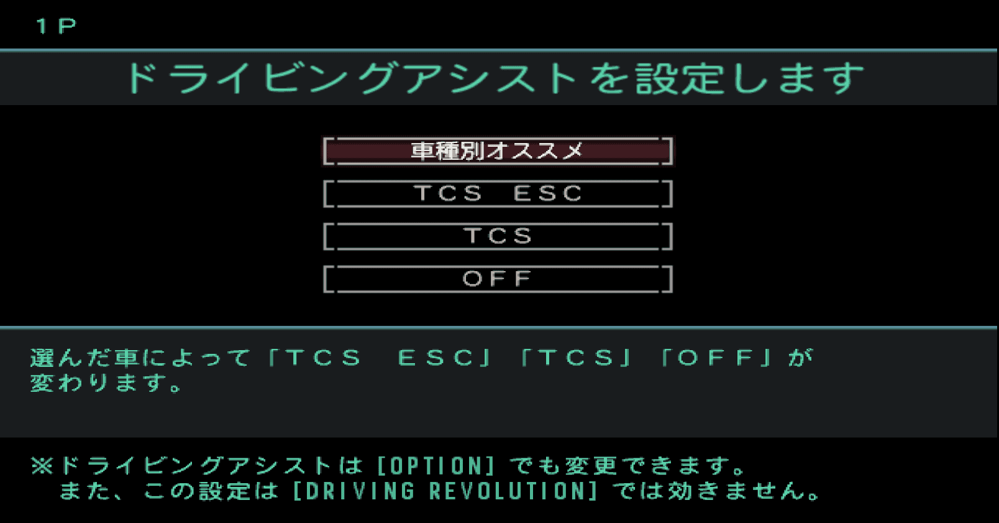

## CAR IS STUCK text
In the map “MIRAGE CROSSING”, there is a special text that says “CAR IS STUCK”. But from the game’s string files and code, there seems to be another text saying “The car is now off the track. Restarting.". This text does not trigger anywhere naturally, but can be triggered by changing some assembly while debugging. This was probably part of a Mirage Time Attack mode, which is not in the final game.

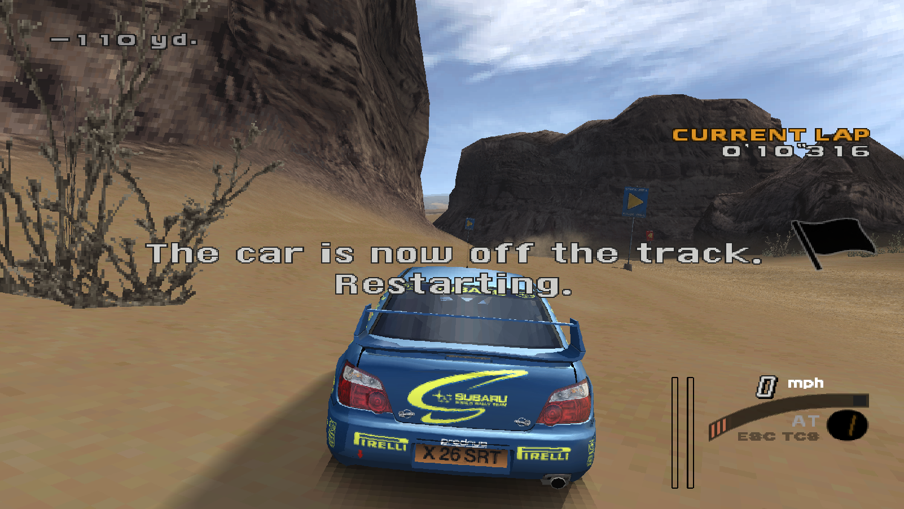

In the OPM build of the game, the string of "CAR IS STUCK" was actually "The car is now stuck in the sand. Restarting."

**CAR STUCK, CAR STUCK, PLEASE, I BEG YOU.**

## Game Builds Dates
As per the game files, and many other sources including a leaked prototype build of the game, the JP build of the game (not the release, the actual compiled code) is 8 days OLDER than the US build of the game, despite the JP build release before the US build

## Unused Maps
Cosmic Winding Reverse and Wild West Enduro Reverse are two maps that exist in the game but are unused. Wild West Enduro Reverse does not have vertex or shading data, so it is a driveable black void.

There are also maps like Garage and Pylon Slalom and Demo Run and SS Circle that are not used, similar to wild west enduro reverse but this time without any driveable data.

You can read about it more at [map_detail.md](map_detail.md)

## Ranking Points
Ranking Points are basically allow you to progress in the game. That means that knowing which rank is given at how many points can help in precise calculations. You can read more about it at [ranking_points.md document](ranking_points.md)

## Drag Race
Ocean bridge is a track that can be used as a Drag Racing track in the game in Time Attack, but becomes endless when driving in Test Drive mode.

## Ocean Bridge Illusion
We used to think that Ocean bridge is infinite, but it is infact not infinite. It is all an illusion.

When you start on ocean bridge, behind you are barriers. Using debug car, if you get past them, you can see that the map does end there.

Also when you go and drive normally in the map, at around 3000m away from start, the game silently teleports the player back to 2000m in an infinite loop, and it is so seamless that it seems like infinite.

## Official Playstation Magazine US
There was an Official Playstation Magazine in the US with a demo of Enthusia from December 2004, which had a lot of interesting things, only a few usable cars, some UI changes, and random stuff.

This disc, built on March 16, 2005, contains Enthusia, built on January 18, 2005. We will come back to the demo versions later.

The Magazine can be found on Internet Archive.

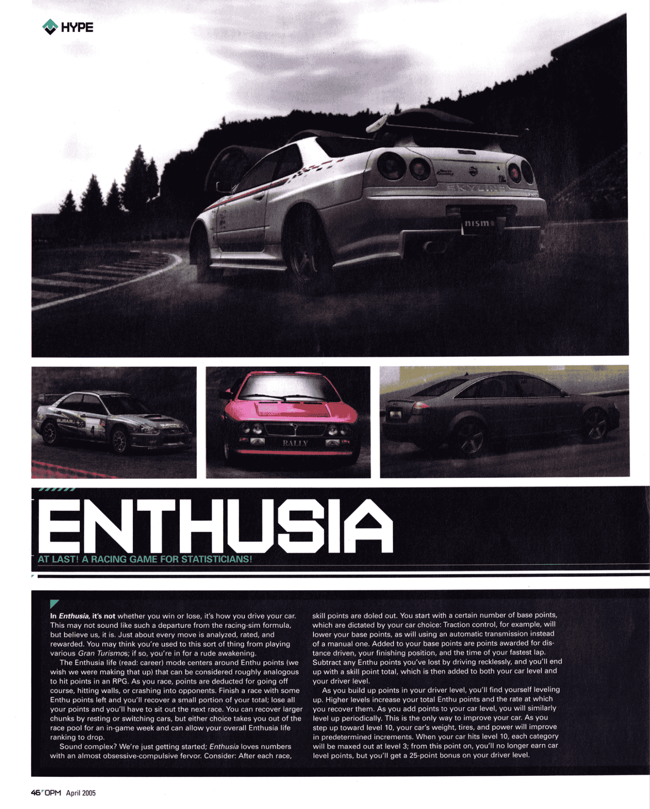
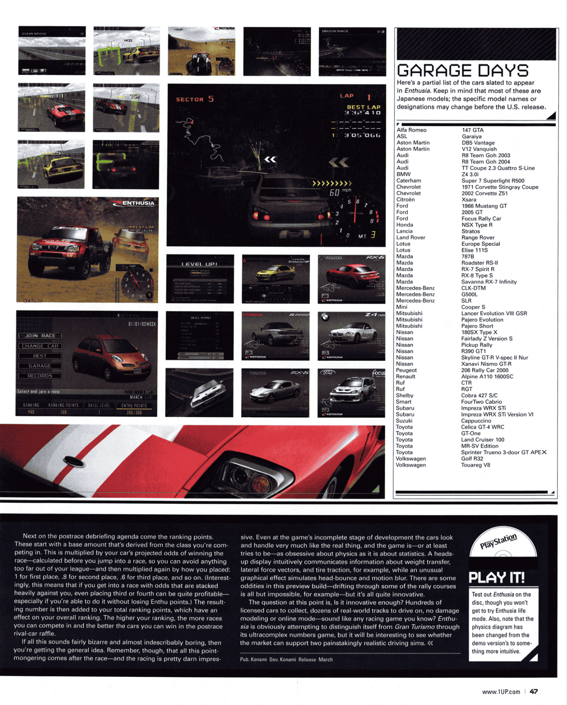

*these are compressed images*

Also, what a tagline - “Enthusia : At last! A racing game for statisticians”

## Different VGS Versions
In the preview and old demos of Enthusia (like the E3 2004 Build), the VGS icon display is different from the release version, only showing the car's lateral and longitudinal G-forces and car's real direction of travel relative to the player's view instead of the weight transfer and tyre grip display we have today.

There is also screenshots of another variation of VGS icon.

Apparently, there were total of three versions of VGS -
- `"Ball Type"`
- `"Deluxe Type"`
- `"Arrow Type"`

## Different Game Version
In Japan, it seems as if there was a specific version of the game called the “Low Price Version” that was just 1890 Yen as compared to the normal price that the game went for, that is around 5000-6000 Yen (Left is low cost, right is normal). There isn’t much documented about this but maybe it was an attempt to get the game to sell more in face of its rather underwhelming release. (it was released right next to Gran Turismo 4, which overshadowed it)

## Game’s Tagline
The game’s tagline is “Change your Real” in its marketing material, which is quite something to say. This is mentioned everywhere, including the JP game cover, US / PAL game cover, guide books, magazines, trailers, etc.

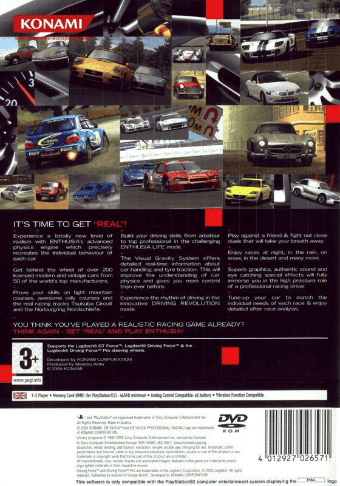
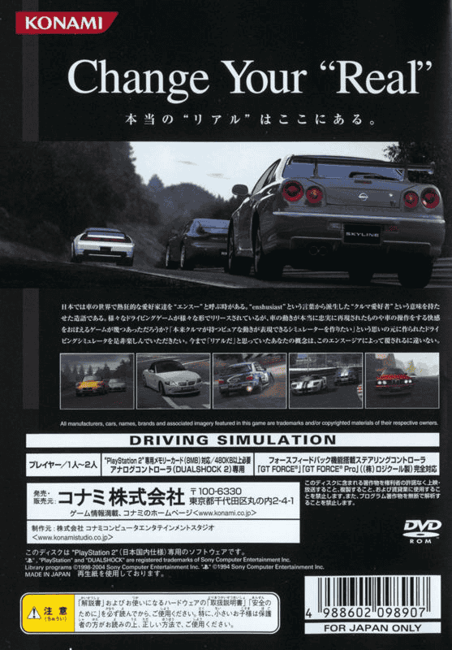


## Interesting Filter Option
In the filter category when choosing a car, you can filter cars based on “RETRACTABLE HEADLIGHTS”, which is an interesting choice

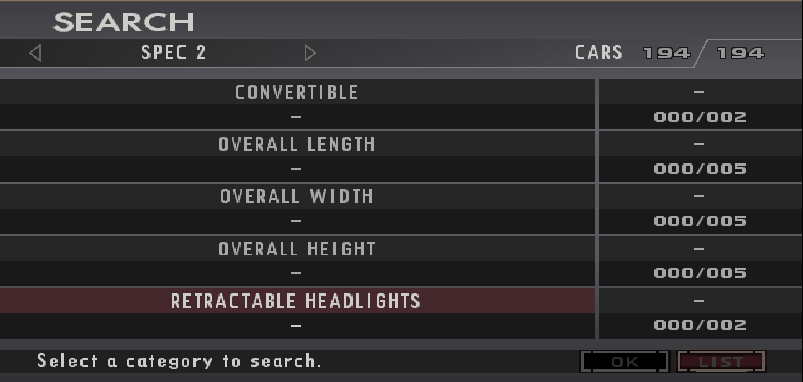

## Hour filter in Sector Times
Enthusia’s Sector times in races can apparently hold even a place for hours spent on the sector, which is strange. Very strange. Which game tester or a dev fucking sat there for a fucking hour on a single sector that they had to add a fucking hour place for sector times.

Easiest way to trigger this is by using the debug car, and skipping sector 1 time and setting a sector 2 time before sector 1. It will show something similar to the image below

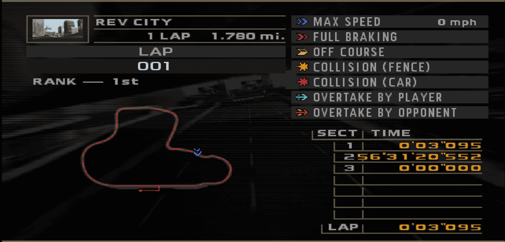

## Interesting AI Behavior
There are several places where the AI seems to slow down more than they should, giving you better chances of winning in slower cars:
- The chicane in Marco Strada.
- The turn that connects the tarmac and dirt roads in Autumn Hill / Mountain.
- The two chicanes in Pacific Gateway.
- The massive banked turn in Löwenseering.

## Out Of Bounds Experience
Even though Enthusia’s collision system is amazing at not allowing you to clip outside the map, if you do manage to get out of the map somehow, especially in tracks like Ocean Bridge and Airport Square, and drive to the end of the map, some weird things tend to happen.

The best example is https://www.youtube.com/watch?v=rZnbEwlUBYg

## Dirt / Snow on Cars
Cars tend to get dirt and snow on them when on rally tracks. Very small detail, but a neat one. Even Gran Turismo 4 does not have this detail.

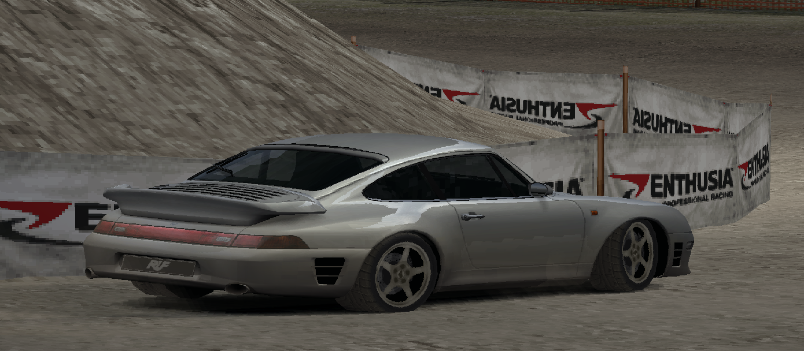

## Black Flag behaviour
In the US build of the game, the Black Flag on the right side disappears as soon as you get it. But in JP and EU version of the game, it stays for the rest of the lap in less opacity.

## CD Projekt Distribution
In Poland, Konami released Enthusia, but it was not distributed by Konami. Instead, it was published, BY CD PROJEKT?

## ENTHU POINTS
In the Japan version of the game, ENTHU POINTS are not actually called ENTHU POINTS, they are instead called DRIVER HP, which makes much more sense than ENTHU POINTS in the US and PAL release of the game.

Also, it was previously just referred to as Driver HP in older versions too.

## Active Aero
This game features active aero for some cars. For example
- Dauer EB110 features an opening wing as soon as you join a race.
- Mercedes Benz Mclaren SLR has active wing. As soon as you go above 95kmph / 59mph, the wing opens up and keeps on. When you brake above that speed threshold, the wing does an airbrake till the threshold and afterwords, completely retreats.

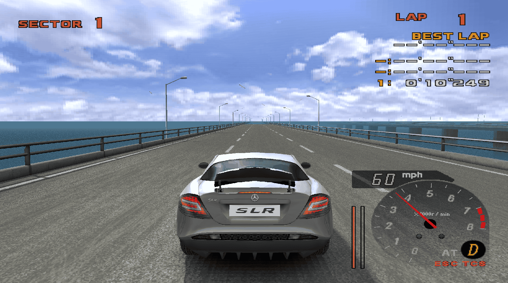

## Rotary Engine Chime
When you hit the RPM limit on a rotary car like the RX7 or the RX8, you hear a subtle engine chime that is meant to indicate that you have hit the max rpm and you should now shift up

## First Gen Prius Pedestrian Warning
If you drive the First Generation Prius in low speed, under a certain threshold like 45mph, you hear a pedastrian warning chime, its really subtle.

## Advanced AI
The AI in this game is truly absurd. They can seemingly adapt to any car changes you throw at them, even if these changes are not intended. For example, disabling ABS using custom cheat instructions. The AI learns that it will not be able to full brake, so it half brakes to avoid locking up the wheels. Another example is mass and physics changes. Changing those also makes the AI adapt.

## Suspension Travel
This game simulates suspension travel very accurately. SUVs and such have very high suspension travel, which functions very accurately. Similarly, sedans have less travel. This is most visible with jumps in maps like Mirage Crossing and Pacific.

Also, increasing or decreasing mass of cars using memory editing results in suspension height changing.

## Speedometer Reading
The speedometer reading in this game works weirdly. Firstly, it is not vehicle speed, but is the wheel speed instead. Secondly, the speedometer reading is delayed to be one update every 20 frames, or 3 updates per second, which is meant to show the digital speedometer delay of that time. This delay can be removed by using the "Remove Speedometer Delay" in PCSX2.

## Car Paints
The car paints in this game arent textures like GT4, but are actual paints.

The car's base paint is always white, and then layers of colors (upto 10 color layers) can be added on top to make different colors.

The colors are not limited to just what you see. Using memory editing, you can change the color to actual RGBA value, and create multiple color layers, which can create perlescent colors for cars like TVR.

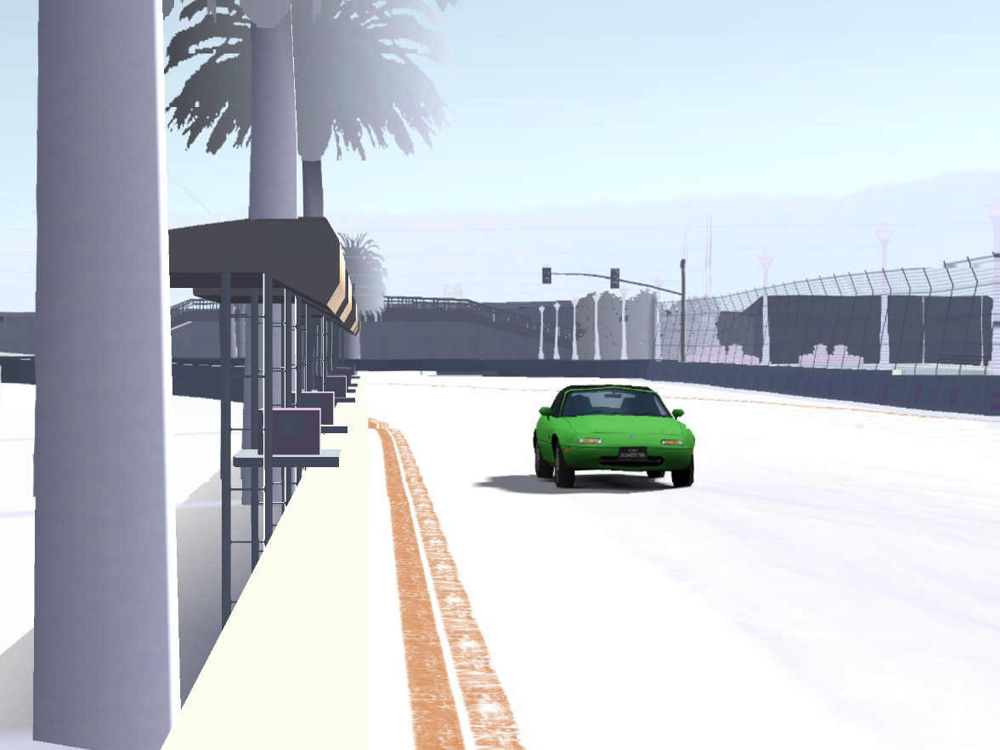
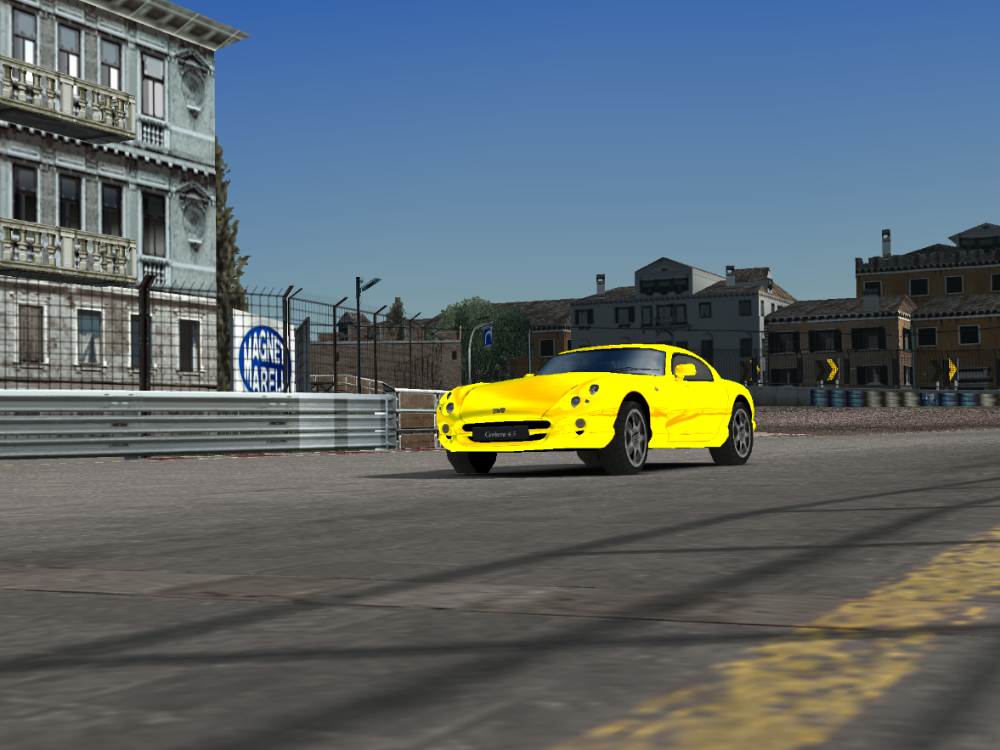

Please ignore the "snowy pacific gateway map" and the "HDR TVR" and an uninvited guests watching the event.

## Mirage’s Track Randomization
Mirage is a very unique map, as in, it has a lot of track randomization. Most of it is very minor, and barely noticeable but some of it is quite obvious.

There are a total of 16 variations that can appear.

The game rolls the RNG every week to choose one of the 16 variation of mirage.

## Engine Simulation
This game simulates engine to a very extreme degree. It doesn't simulate moving parts, but it simulates the engine as a unit with its own drag, friction, etc.

## Driver Weight
Every car's weight in race is increased by 70 KG. That means that the driver's weight is being added to the car, and the driver canonically weighs 70KG.

## Japanese Text in US Build
You can enable Japanese text for cars and maps in the game by using memory editing. This also results in changing of the units from imperial to metric.

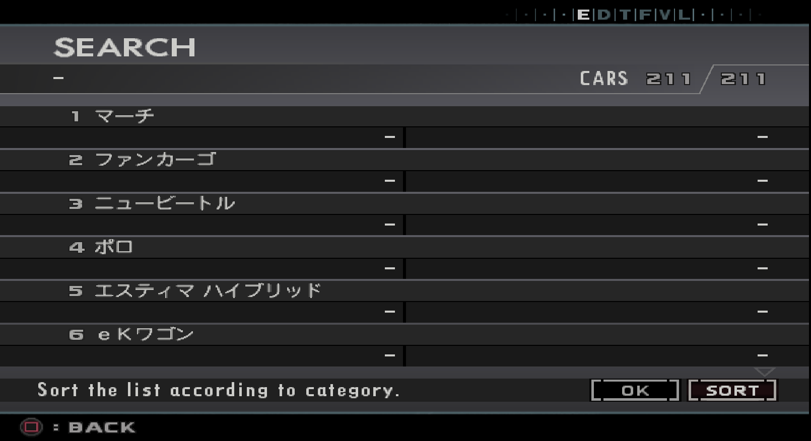

## Hybrid Car Cruise Assist
The Prius and Estima, when you let go of the throttle, will use the electric power of the car to keep on cruising, so it slows down less. This is visible using the VGS where you can see torque applied to the car.

The Insight also holds speed but under 8kmph or 4mph. This is probably used for Stop-And-Go traffic in real life. Even if you hold the clutch on the Insight, it will keep on cruising.

# Archive Facts
These contain the facts from different builds of the game, and stuff found hidden in the game files.

## Game Builds
This a long section.

There are several game versions released before the game’s actual release and after release. These have an interesting amount of information hidden in them. All of the ones we could find are in the list below

Please note that this list is incomplete and I personally believe there are many many more builds that are just left undiscovered, yet to be found. Please, if you find any build, tell us about them.

So far, the only builds unknown are `"2004 GC"` and some other demo builds, maybe even other event showcase builds.

Each one of these builds below (to an extent) can be found on places like `archive.org`

### Official Playstation Magazine DEMO Disk
`SCUS-97443`

In the `Official U.S. PlayStation Magazine Demo Disc 91`, there is a demo of Enthusia.

This also seems to be from `April 2004`

A showcase can be seen here - https://www.youtube.com/watch?v=LKWDqTi6pDo

Some features include
- Three tracks
  - Speediapolis Ring
    - Cars are
      - Audi R8 Team Goh 2004
      - Toyota GT-ONE
      - Nissan R390 GT1
      - Mazda 787B
  - Burgenschlucht (Game refers to banners inside map as Werz Bahn)
    - Cars are
      - Volkswagen Golf R32
        - The logo for the manufacturer looks different from final game
      - Audi TT Quattro Coupe
      - Alfa 147 GTA
      - Aston Martin V12 Vanquish
      - Mercedes Benz CLK-DTM
  - Marco Strada Wet
    - Cars are
      - Fiat 500F
        - This uses a different default color
      - smart fortwo cabrio
      - Mini Cooper S
      - Citroen Saxo VTS
      - Mazda Roadster RS-II
      - Lotus Elise 111S
- The tracks selection preview are actual videos and not just static images
- A crosshair like thing appears when selecting or hovering over items
- Apart from the usual modes, there is a "P" mode on top right 
  - E - Enthusia Life
  - P - ? (Presumed Professional Racing) (later found out as Prize Racing)
  - F - Free Racing
  - T - Time Trial
  - 2 - 2P mode
  - Dr - Driving Revolution
  - Da - Data
  - O - Options
- The UI looks very different
- The car selection screen shows difficulty below the car preview
- Lighting is different in garage
- The car selection camera is very different 
- Race cars use the same Analogue RPM gauge that normal cars use, rather than their own custom gauge
- VGS is very different 
  - The red needle represents the tire direction it seems
  - The arrows represent the G loads
  - Its harder to read in general
- Rear view camera has a much much lower render distance than final game 
- 787B sounds much different than final game
- Speediapolis music is very different compared to final game
- Burgenschlucht uses same music as Speediapolis
- Music in Marco Strada Wet is different than final game
- A pit stop sign was removed from Marco Strada wet, which means there was meant to be pit stops.
- Result screen is much much different than final game
- When loading the game, the control scheme shows right stick to "Move camera" which is not present in final game or even demo build
- Minimap looks much much smaller

#### From Internal Code

- In aspiration, they called `Turbocharged` `TB` in short form, which, uh, could be misinterpreted as `Tuberculosis`. No wonder they changed it in final game. Call it `Turboculosis`.
- There does not seem to be a `F` class. Only `R, A, B, C, D, E` classes.
- `Boxer` engine is called `Flat` engine.

### Japan Trial Demo
`SLPM-61110`

This demo version, which could be played in Japanese game stores, was built on December 20, 2004, about a month before the final build in Japan. This also has a lot of interesting facts about it
- It has a trial timer on each map
- It comes with 4 Maps
- It comes with 24 Cars
- The music is basically the same as the final release
- Some cars are locked and cannot be accessed
- A different loading icon

This version also has some hidden assets we will see later.

This is dated `December 2004`

### US Demo
`SLUS-29151`

This is a demo version of the game that was released in the US around the time of the game’s release. It also has a few notable things about it.
- Only two cars, both are Ford
  - Ford Mustang
  - Ford GT
- 3 Maps
- Interestingly, it also has a versus mode, that is quite different to how the versus mode works in the final game release
  - It shows the ODDS for the cars when choosing for both players
  - The selection screen is quite different
  - The versus mode seems to be broken as it just puts you out of the map and crashes the game (probably a PCSX2 issue)

### EU Demo
`SLED-53330`

This is another demo version of the game. This has not that many changes to other demos
- Inclusion of video files as track previews
- 3 Maps and a few cars
- Inclusion of a language select screen

This was bundled with OPM EU magazine.

It is dated `April 2005`

Some known footage - 
- https://www.youtube.com/watch?v=udvZOvzuujE
- https://www.youtube.com/watch?v=q4EXU51Q898
- https://www.youtube.com/watch?v=Mq5mv6cZfos
- https://www.youtube.com/watch?v=ri6NokPQF0g
- https://www.youtube.com/watch?v=S7ATMNOY43c
- https://www.youtube.com/watch?v=XCnGgXP8CPw
- https://www.youtube.com/watch?v=UEZ30nJ5-9Y


### Italian Demo
`SLED-53337`

This is another demo version of the game, but seems to be basically the same as the EU version, except that it was only in Italian, and was released in Italy.

It is dated `March 2005`

It was bundled with the Italian sport magazine "La Gazzetta Dello Sport".

### SUBARU Impreza WRX STI Trial Version
`SLPM-68519`

This is the most significant demo release, as it is the most widely known. This was released a few months after the release of the final game (May 9, 2005). It has a few changes to the final game such as
- Just one driveable car (the NEW SUBARU Impreza WRX STI)
- 3 Maps
- Only free race and nothing else

Some footage
- https://www.youtube.com/watch?v=kvwrmVE1hPw
- https://www.youtube.com/watch?v=5ZR2lJ-JE5o

### January 3rd 2005 Prototype
`SLUS-20967` (same as US retail build)

This is basically a preview build of the game that was leaked and is availabe on archive.org and also can be found on hiddenplace.org. It is available in English and is a US build prototype. It was built 15 days before the final US build of the game. There is a build date watermark on top left corner. Saves from final game are not compaitable with this build. It also seems that it has no USB protection.

### January 16th 2005 Prototype
`SLUS-20967` (same as US retail build)

Basically the same as the the previous build, can be found similarly on both platforms. Apparently it is a DUBAI preview.

### Enthusia US Retail Build
`	SLUS-20967`

### Enthusia JP Retail Build
`SLPM-65948`

### Enthusia EU Retail Build
`SLES-53125`

### Konami Dendou Release
`SLPM-66257`

As the game did not sell well, Konami sold it for much cheaper later on in their Dendou collection.

This is basically the same as the Japanese retail copy, but just cheaper.

Here is one of the best detailed links for it -
- https://psxdatacenter.com/psx2/games2/SLPM-66257.html

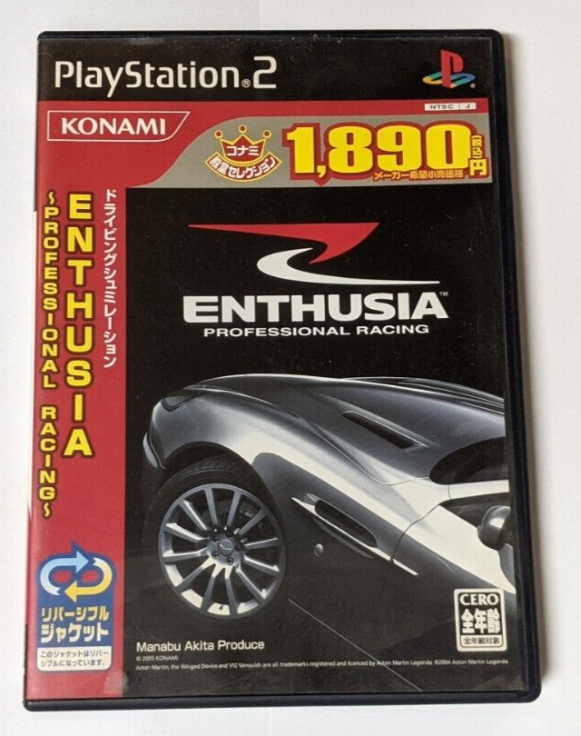

### Unknown Builds
#### E3 2004 Build
No real things were found about this build other than old IGN footage, some trailers, and some articles. 
- https://game.watch.impress.co.jp/docs/20040513/kona4.htm
- 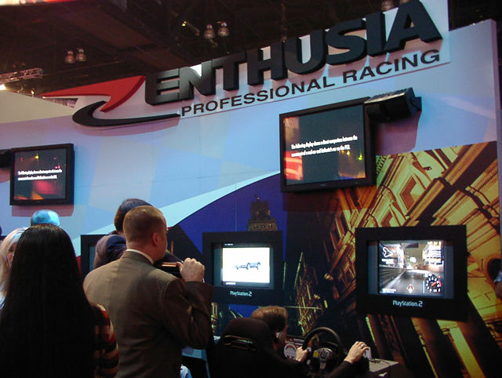
- 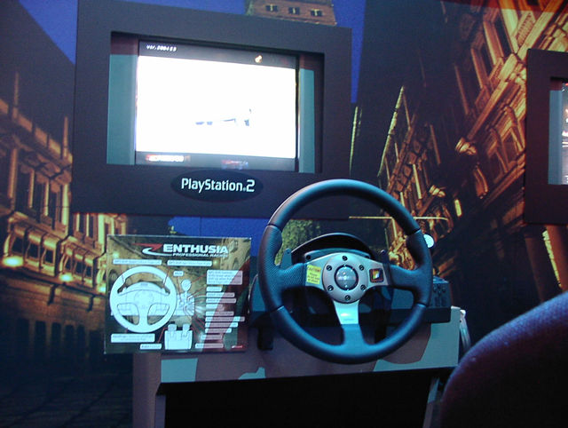

#### Tokyo Games Show Build
Again, same as E3 Builds.
Apparently it had 
- Dedicated cockpit competition area
- Live time attack
- Staff manually recording times
- Five selectable stages (E3 only had three)
- Both uphill and downhill Dragon Range
- Updated VGS behavior
- Updated wheel hardware

Some information about it
- https://game.watch.impress.co.jp/docs/20040925/kona2.htm  
- 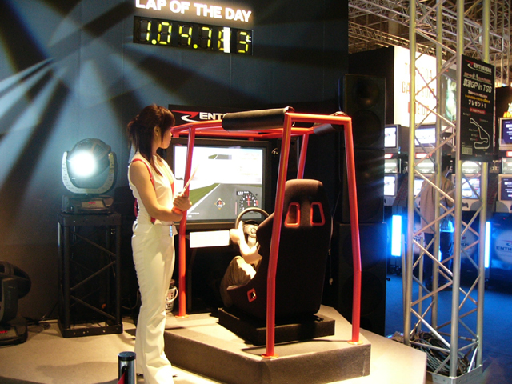
- 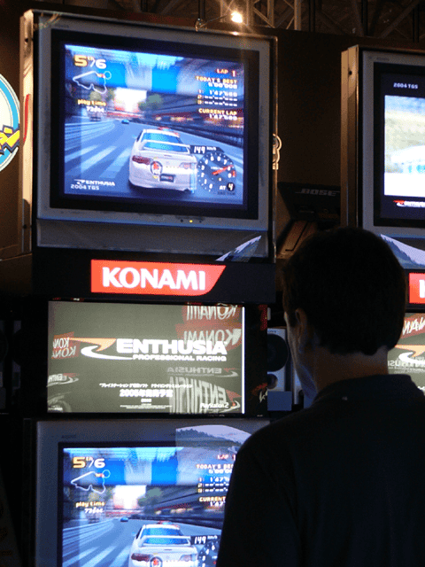

## Unused Dev Comments
There are 2 images in the final game files, that seem to be some devs scribbled notes about some other dev forgetting or miswriting the IDs of the maps.

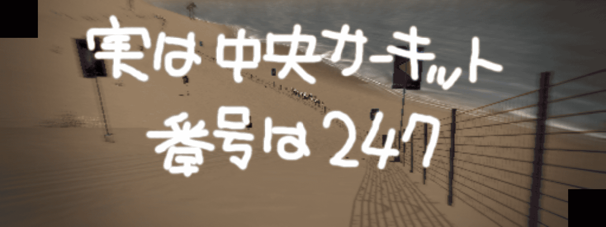
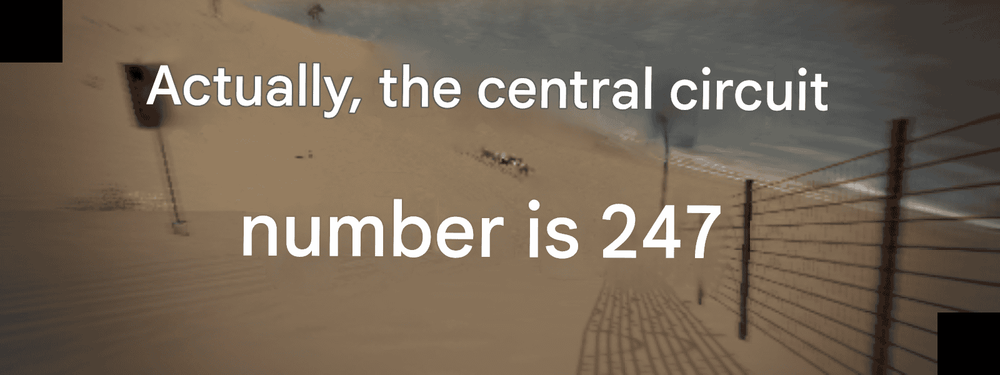

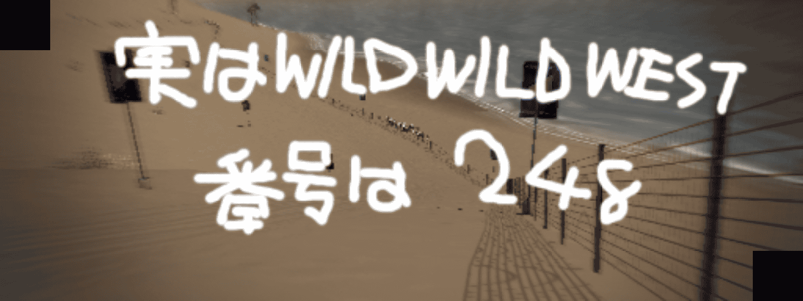
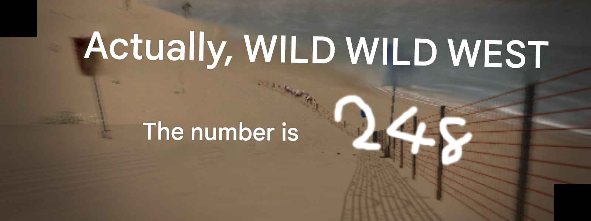


First image refers to an unused Cosmic Winding Reverse map.

Second image refers to an unused Wild West Enduro Reverse map, but it has no data.

## Unused Concept GUI
In the game files when extracted, there seem to be exactly 2 concept gui images, that showcase different text and font variations. Interestingly, it also has an odometer for cars. Weirdly, the map layout and the actual map do not seem to match at all.

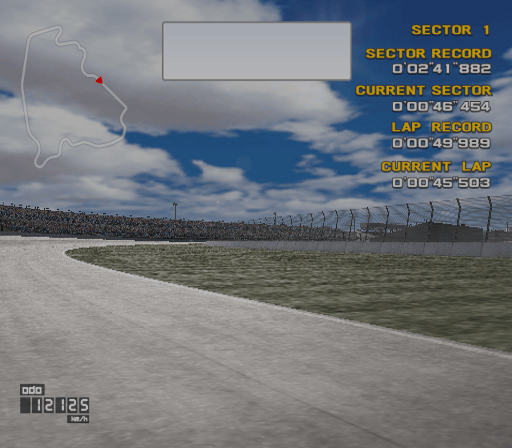
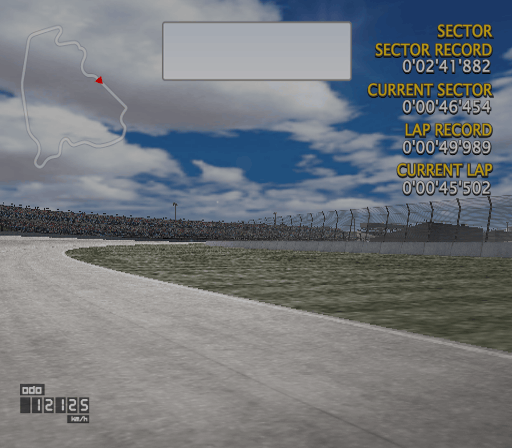

## Unused Speedometer / Tachometer Concepts
Alongside the unused concept UI, we also found 5 different tachometer concepts. Interestingly, some of them have actual boost gauges that are not present in the final game. Also even more interestingly, ESC is instead referred to as KSC, which we joke about being literally “Konami Stability Control”

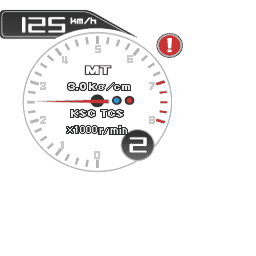
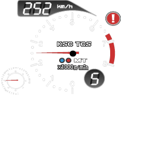
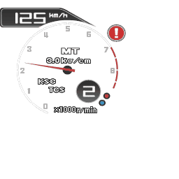
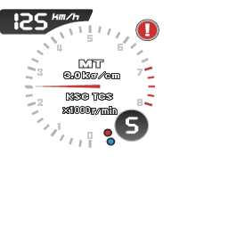
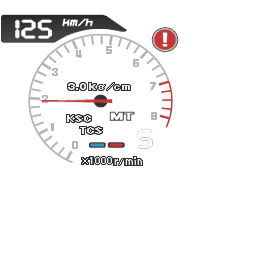


## Unused Graphics and Speculated Demo Versions
In the game files, there are 3 different graphics for 3 different cars that seem to be a leftover from some kind of demo. These images even contain car information about them.

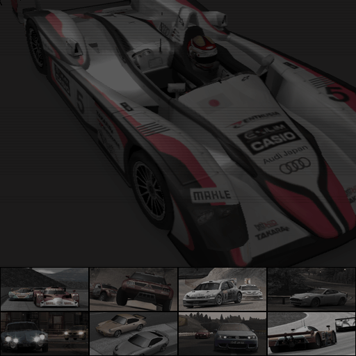
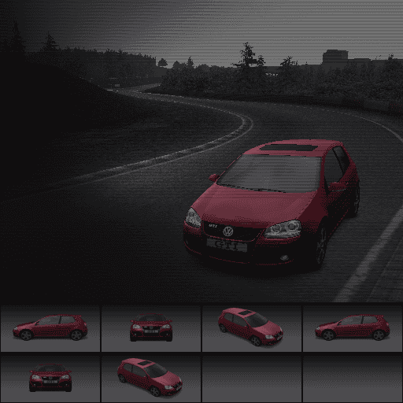
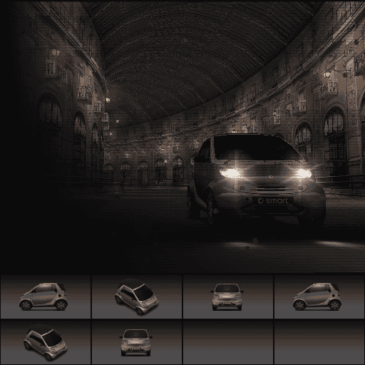

## Debug Car
In the game’s code, there seems to be a random debug mode for the cars that you can enable by memory editing. It seems that this was a leftover from the development environment of the game and developers used it to quickly complete races.

## VGS Patent
VGS as a technology was so great, that the technology was literally patented in multiple countries, with the patent number `2004134629 (JP)` / `20070209436A1 (US)`, which you can search on public patent. This patent in the US is now abandoned. 

However, strangely enough, the Japanese patent seems to still have its renewal payments fulfilled by Konami up to as late as the 13th of January 2023, though it is now considered expired and its IP rights for Konami have been lost.

## Save File Transfer
Follow [this document for more info](../tools/save_transfer.md).

## B Spec in Enthusia
Even though the game does not itself support B Spec, you can kinda make it happen by using the “Auto Driver” cheat and “Auto Driver RS” cheat from the same cheats github repository. This will allow you to sit back, enjoy, while the AI drives the car itself. Though the AI is not that good at blocking. Imagine having B spec in Enthusia before Gran Turismo 7.

## Removed "PRIZE RACE" Mode
From the game's SHIFT-JIS strings, it looks like there existed a mode called "PRIZE RACE" or "PR". From other clues from the same strings, there are references to things like
- `BET`
- `ODDS`
- `PRIZE`
- `FUNDS`
- `CHIPS`
- `ROUND`
- `$1位の配当が得られました。` ~= `Received a payout for {x} place.` where `x` is equal to position in race
- `配当はありません。` ~= `No payout.`
- `レースのグレードが上がりました。` ~= `The race grade has increased.`
- `１レースのＢＥＴが$2枚になりました。` ~= `The bet per race is now {x}.` where `x` is equal to number of chips
- `ＣＨＩＰがなくなりました` ~= `You have run out of chips.`

It also seems like there were meant to be bosses, with references like
- `DANCE-MAN` in `MARCO STRADA` with a `RACING CAR`
  - `2000cc TURBO3`
  - `31.00kgm/5300rpm`
  - `280ps/7300rpm`
  - `1350kg`
  - `CLASS A`
  - `CLASS R`
  - `MR`

There are even more proof when looking back at the OPM strings. It has references like
- `\"Prize Race\" モードのファイル` ~ `"Prize Race" mode file`
- `%F%CYou gained %d chips!`

This suggests there was a mode where you could bet chips on races and depending on your position in the race. This can be seen with references in older game builds, string files, and old E3 footage.

## Removed "Championships"
There seems to be strings related to `QUALIFY` and `予選の結果です` ~= `Here are the results of the qualifiers.`.

There are also lines like
- `Championship status has been maintained for {x} weeks` where `x` is number
- `Championship status has been maintained for over {x} weeks` where `x` is number

There are also lines like
- `When out of course and you are stuck, the game will restart.` 
- `Experience 2 consecutive short-track races.`

Also in OPM demo, likes like 
- `%F%CGet ready for Race 2`

are there

## Removed Enthusia Life Features
From the OPM Demo of the game, it looks like Enthusia life was supposed to have a lot more than it currently has.

(Please note that these are directly from strings file of the .elf file of the game itself taken out using Ghidra, and then machine translated for longer sentences and manually for shorter ones.)

```py
"開発中。
週末のレースに向けて、運転練習に出かけます。
１フェイズを消費します。
パーツ、新車などを入手するために出かけます。１フェイズを消費します。
ゆっくり休み、ドライバーズＨＰを回復します。１フェイズを消費します。
カレンダーやスペックなどの情報を確認します。フェイズを消費しません。
タイトルへ戻ります。"

TRANSLATED - 

"Currently in development.
Head out for driving practice ahead of the weekend's race. Consumes 1 phase. 
Head out to acquire parts, a new car, etc. Consumes 1 phase. 
Rest and recover Driver HP. Consumes 1 phase. 
Check information such as the calendar and specifications. Does not consume a phase. 
Return to the title screen."
```

It looks like
- You could acquire parts from races
- Doing test drives would consume a week (basically practice mode)

Some other strings are - 

`レースに出かけます。１フェイズを消費します。` = `Head to the race. Consumes 1 phase.`

```py
"運転の基本から応用までを、効率的に学ぶことができます。
自分の車で、好きなコースを好きなだけ周回することができます。
週ごとに開催される、さまざまなイベントに参加することができます。"

TRANSLATED - 

"You can efficiently learn everything from the basics to advanced driving techniques. 
You can drive your own car and complete as many laps as you like on your favorite track. 
You can participate in a variety of events held every week."
```

```py
"スキルポイントに見合った新車を、無償で入手することができます。
コインを使って、チューニングパーツを入手、装着することができます。
スキルポイントやガレージなどがなくても、車を借りることができます。"

TRANSLATED - 

"You can get a new car for free based on your skill points. 
You can use coins to purchase and install tuning parts. 
You can rent a car even if you don't have any skill points or a garage."
```

```py
"チャンピオンシップに登録した、すべてのランキングを確認します。
カーライフの進行状況を確認します。
自分の車のスペック、戦績を確認します。
自分の車で参加することができるレースを確認します。
過去に所有していた車のスペック、戦績を確認します。"

TRANSLATED - 

"View all rankings for the Championship. 
Check your progress in Car Life. 
View your car's specs and race results. 
See which races you can enter with your car. 
View the specs and race results for cars you've owned in the past."
```
The point above basically confirms the `CHAMPIONSHIP` fact.

```py
"まず車を選択してください。
今回はユーノスロードスターのみ選択できます。"

TRANSLATED - 

"First, please select a car. 
In this instance, only the Eunos Roadster is available for selection."
```
Maybe this is a tutorial with the `Eunos Roadster`?

```py
"ランキング登録します。
イニシャルを入力して下さい。
第1000位に登録されました。
まずはフレッシュマンレースに参加していただきます。
がんばってください。」"

TRANSLATED - 

"Registering you for the rankings. 
Please enter your initials. 
You have been registered at 1,000th place. 
First, you will participate in the Freshman Race. 
Good luck."
```
This looks like game describing rankings.

```py
"高回転ハイパワー化をはじめ、ポート研磨、ボアアップ、バランス取り、ＲＯＭチューンなどを行います。"

TRANSLATED - 

"We perform a variety of services, including high-revving and high-power modifications, port polishing, bore-up, balancing, and ROM tuning."
```
THIS IS A PROPER TUNING SHOP SUGGESTING STRING.

```py
"ターボ、スーパーチャージャーなどの加給器の容量アップ、圧縮比の調整などを行います。"

TRANSLATED - 

"We increase the capacity of turbochargers, superchargers, and other forced-induction systems, and adjust the compression ratio."
```
This just confirms it.

```py
"インタークーラーの大容量化など冷却系の強化を行います。"

TRANSLATED - 

"We will enhance the cooling system by increasing the capacity of the intercooler and other measures."
```
This says that the tuning was really indepth.

```py
"マフラーを吹け上がりのよいものに交換するなど吸排気系の強化を行います。"

TRANSLATED - 

"We'll upgrade the intake and exhaust systems, such as by replacing the muffler with one that provides better acceleration."
```
Even more confirmation.

```py
"クラッチの大容量化、フライホイールの軽量化など駆動伝達系の強化を行います。"

TRANSLATED -

"We will enhance the drivetrain by increasing the clutch capacity and reducing the weight of the flywheel, among other measures."
```
Do I say more. This would have been sooooo cool.

```py
"ローターの大径化、パッドの材質変更など制動力の強化を行います。"

TRANSLATED - 

"We will enhance braking performance by increasing the rotor diameter and changing the pad material, among other measures."
```
Wow.

```py
"サスペンションキットの交換により挙動特性の調整が可能になります。"

TRANSLATED - 

"Replacing the suspension kit allows you to adjust the vehicle's handling characteristics."
```
If only.

```py
"快適パーツを外しての軽量化や、ロールバー装着による剛性アップなどを行います。"

TRANSLATED - 

"We'll reduce weight by removing non-essential parts and increase rigidity by installing a roll bar."
```
Just imagine.

```py
"タイヤやホイールを交換します。"

TRANSLATED - 

"We'll replace your tires and wheels."
```
...and wheels? RIMS?

```py
"電子制御系パーツの装着、または交換を行います。
今話題のアーシングとプラグ交換でレスポンスが向上します。
カム、ヘッドガスケット交換によりパワーを引き出します。
鍛造ピストンキット、バルブ交換などメカチューン！コンプリートエンジンに載せ換えます。"

TRANSLATED - 

"We install or replace electronic control system parts. 
We improve responsiveness through grounding—a hot topic right now—and spark plug replacement. 
We maximize power by replacing the camshaft and cylinder head gasket. 
We perform mechanical tuning, such as installing forged piston kits and replacing valves! We’ll swap in a complete engine."
```
I am genuinely done. ENGINE REPLACEMENT? ENGINE SWAPPING?

```py
"ノーマルの特性はそのままにブーストアップ仕様です。"

TRANSLATED -

"This is a boosted version that retains the standard model's characteristics."
```
Insane.

```py
"タービン交換を行います。
扱いやすいフラットな特性です。"

TRANSLATED - 

"We'll replace the turbine. 
It has a flat response curve that makes it easy to handle."
```
Turbo swaps.

```py
"フルタービンキットです、低回転域から十分なトルクを発生します。"

TRANSLATED - 

"This is a full turbine kit that delivers ample torque even at low RPMs."
```
Different Type Of Turbo Kits.

```py
"ビッグシングルタービンです。
低回転域は苦手です。"

TRANSLATED - 

"It's a big single-turbo engine. 
It doesn't perform well at low RPMs."
```
Single turbo.

```py
"ピークパワー重視のタービンキットです。
多少ピーキーな特性になります。"

TRANSLATED -

"This is a turbine kit designed for peak power. 
It has somewhat peaky performance characteristics."
```
Peaky.

```py
"Ｆ１がターボ全盛期のころと同等のスペックを持ちます。
扱いにくい特性になりますが最強です。
容量の大きいラジエーターに交換し冷却効率を上げます。
３層式オールアルミインタークーラー、冷え冷えです。
ストリート用マフラー、いい音です。
フルチタンスポーツマフラーです。直管、カチ上げ、爆音マフラーです。"

TRANSLATED - 

"It has specs comparable to those of F1 cars during the heyday of turbocharging. 
It’s a bit tricky to handle, but it’s the most powerful. 
We’ve swapped in a larger-capacity radiator to improve cooling efficiency. 
It features a three-layer all-aluminum intercooler—it keeps things nice and cool. 
The street-legal muffler sounds great. 
It’s a full-titanium sports muffler—straight-pipe, up-piped, and incredibly loud."
```
WHAT EVEN WAS THIS GAME?

We also have `PART NAMES`
- `"フライホイール ストリート"` = `"Flywheel Street"`
- `"フライホイール スポーツ"` = `"Flywheel Sports"`
- `"フライホイール レーシング"` = `"Flywheel Racing"`
- `"強化シングルクラッチ"` = `"Reinforced Single Clutch"`
- `"ツインプレートクラッチ"` = `"Twin-plate clutch"`
- `"トリプルプレートクラッチ"` = `"Triple-plate clutch"`
- `"セミメタルブレーキ"` = `"Semi-metal brakes"`
- `"カーボンブレーキ"` = `"Carbon brakes"`
- `"サスペンション レベル１"` = `"Suspension Level 1"`
- `"サスペンション レベル２"` = `"Suspension Level 3"`
- `"ボデー ステージ１"` = `"Body Stage 1"`
- `"ボデー ステージ２"` = `"Body Stage 2"`
- `"ボデー ステージ３"` = `"Body Stage 3"`
- `"ボデー ステージ４"` = `"Body Stage 4"`
- `"タイヤ スポーツ"` = `"Sports Tires"`
- `"タイヤ レーシング"` = `"Racing Tires"`
- `"タイヤ ダート"` = `"Dirt Tires"`
- `"タイヤ スタッドレス"` = `"Studless Tires"` (probably snow tires)
  
Also it looks like `Driving Revolution` was interally referred to as `DDR`. There are references to even more removed features.
- `"ESC(2P)"`
- `"TCS(2P)"`
- `"DDR GHOST"` = A ghost for `DR`
- `"REALTIME INFO"` = Telemetry
- `"TUTO CUR LEVEL"` = A TUTORIAL LEVEL?

Also, it looks like racers had actual names. We aren't sure if they are actual names of devs or just names for racers.
```
Tuto
Yogo
Yanagida
Yamanishi
Yamaji
Yamagishi
Yamada
Watanabe
Wakisaka
Wada-q
Uematsu
Tsutsui
Tsuchiya
Treluyer
Taniguchi
Tanigawa
Tanaka
Tamanaka
Takeuchi
Takamizawa
Takahashi
Takagi
Tajima
Tachikawa
Sunako
Suga
Shimizu
Shibahara
Schwager
Sawa
Sasaki
Philippe
Osamu
Orido
Omoto
Ohi
Nitta
Nishizawa
Namekawa
Nagashima
Motoyama
Miyagawa
Mitsuyama
Mitsusada
Mifune
Michigami
Matsunaga
Matsuda
Lyons
Kwan
Kurosawa
Kurashima
Krumm
Kogure
Kobayashi
Kishi
Kinoshita
Katsumata
Kato
Kataoka
Kaneishi
Kageyama
Jyonai
Ito
Ishibashi
Iijima
Iida
Ide
Idaka
Hoshino
Hitotsuyama
Hirakawa
Hattori
Hashimoto
Haga
Goto
Dufour
Coronel
Comas
Asai
Ara
Apicella
Aoki
```

Also, it looks like you could pick custom colors from RGB / HSL. Unsure if this is debug or actual intended feature.

## Removed And Changed Maps
It looks like there were removed or changed maps like
- `"SPACE CENTER EGGWAY"` = `"COSMIC EGGWAY"`
- `""SPACE CENTER CIRCUIT"` = `"COSMIC CIRCUIT"`
- `"ROWENBURG RING"` = Maybe a `Nurburgring GP` or beta name for `Lowenseering`
- `""SCHNEE BAHN"'` = Maybe `Wintertraum`
- `"ガレージ"` = `"Garage"`
- `"パイロンスラローム"` = `"Pylon slalom"`
- `"定常円旋回"` = `"Steady-state circular turning"` = `"SS CIRCLE"`
- `"挙動デモ"` = `"Behavioral demo"` = `"DEMO RUN"` = Probably debug stuff
- `"MINI CIRCUIT"`

# Map Facts
## Rev City
- When you stop before turn 1 inside the turn in forward layout, and look back / turn back, you can see pedastrians walking in the walkway above in the tunnel with the shadows showing.
- The cameras in Rev City tunnel blink a red light.
- There are trucks driving around in a road on the track.
- You can see planes flying from Aiport Square into Rev City.

## Route de La Seine
- On the left side of the map using debug car, you can see a track map that is different from the final map. Apparently that map is closer to the real life roads there, but due to having an awkward sharp turn layout, they had to change it so it becomes easier and more fun for players to drive.

## Burgerschlucht
- This was previously called "Werz Bahn" in the game files.

## Nurburgring Nordschleife
- Nordschleife as a track is mostly height accurate, with the highest point in game coordinate system being accurate to the height from ocean level in real life (~620m)

## Airport Square
- You can see Rev City in the background.

# Other Things
This section has just random things

## Interesting Strings
There are some minor errors and interesting things in the game strings that are very easily visible like
- `RS 01/03 THE KING OF ICE MAN` - `Compete to earn the title of "Iceman," snowy racetrack expert.` where the `,` is in the wrong place
- `RS 09/03 BAJA MIRAGE` - `Go cross country, but keep up the speed!!`, where they use `!!`, they were excited for this event

# Web Archive Things
These are other facts and things like stuff from web archive

## Original Game Teaser
[Link](https://web.archive.org/web/20050601001229/http://www.konami.jp/gs/game/enthusia/)

This is the original teaser for the game, and also shows the origin of the name “ENTHUSIA”

The name is taken from parts of five words, likely chosen by Konami to describe the game and the game experience:
- Concentration
- Exhilaration
- Exultation
- Fascination
- Determination

## Tokyo Auto Salon
[Link](https://web.archive.org/web/20050315083255/http://www.watch.impress.co.jp/GAME/docs/20050114/auto.htm)

Enthusia did also appear in the Tokyo Auto Saloon, with a lot of booths to play the game, with old UI and VGS and other changes. This game was quite big and well marketed in Japan, unlike in the West

## Original Game Guide
[Link](https://archive.org/details/ps2_Enthusia_Professional_Racing_USA)

This is the original game guide for Enthusia. It has some information, but most of it is not particularly useful, and some stuff is outright wrong.

## Team GOH’s Audi R8 ingame
[Link1](https://web.archive.org/web/20070808171547mp_/http://www.konami.jp/gs/game/enthusia/eng/event/goh.html)

[Link2](https://en.wikipedia.org/wiki/2004_24_Hours_of_Le_Mans)

In this information page about Team Goh, a racing team whose livery appears on the two Audi R8 race cars in the game, it reveals that Manabu Akita, the director of this game, was part of that team's staff at some point, the same guy who patented the VGS technology. This team also won the 24h of Lemans Race in 2004.

## Enthusia’s Sequel
Even though we never got a sequel to Enthusia, there was one game that did use its assets which was also made by Konami. It was Road Fighters 2010, a Japan exclusive arcade game that reused a lot of tracks, like Autumn Hill, Dragon Range, etc. A lot of these can be seen in archive pages and images.
- [Speediapolis Ring](https://web.archive.org/web/20150818014151/http://www.konami.jp/am/roadfighters/rfs_course_course01.html)
- [Autumn Hill](https://web.archive.org/web/20150818014157/http://www.konami.jp/am/roadfighters/rfs_course_course02.html)
- [Lowenseering](http://web.archive.org/web/20150818014206/http://www.konami.jp/am/roadfighters/rfs_course_course05.html)
- [Burgenschlucht](https://web.archive.org/web/20150818014218/http://www.konami.jp/am/roadfighters/rfs_course_course06.html)
- [Dragon Range (Downhill)](https://web.archive.org/web/20150818014221/http://www.konami.jp/am/roadfighters/rfs_course_course07.html)
- [Dragon Range (Uphill)](https://web.archive.org/web/20150818014227/http://www.konami.jp/am/roadfighters/rfs_course_course08.html)
- [Victoria Road](https://web.archive.org/web/20150818014232/http://www.konami.jp/am/roadfighters/rfs_course_course09.html)
- [Mystic Caveway](https://web.archive.org/web/20150818014237/http://www.konami.jp/am/roadfighters/rfs_course_course10.html)
- [Rev City](https://web.archive.org/web/20150818014242/http://www.konami.jp/am/roadfighters/rfs_course_course11.html)

## E3 2004 Showcase
There are a lot of Enthusia videos from the E3 demo. Most of these contain very old UI of the game, and are very low quality.
- [IGN Video1](https://www.youtube.com/watch?v=dF9H-dOznrg)
- [IGN Video2](https://www.youtube.com/watch?v=XP_0RyYiEWs)
- [IGN Video3](https://www.youtube.com/watch?v=QoOFJGCZkVU)

## Enthusia Marketing Articles
Enthusia was marketed really well in Japan and was even considered a direct rival / competitor to Gran Turismo 4. Some of the articles that show this are below (most of them are in Japanese, so please translate if you cannot read Japanese)
- [Game Watch Article - Konami E3 Press Conference Report](https://web.archive.org/web/20050315083350/http://www.watch.impress.co.jp/GAME/DOCS/20040512/kona1.htm)
- [Game Watch Report - Tokyo Game Show 2004 Booth Report - Konami Edition](https://web.archive.org/web/20050311113605/http://www.watch.impress.co.jp/GAME/docs/20040925/kona2.htm)

## Popularity Among Japanese People
Enthusia, as previously stated, was quite popular in Japan, unlike the west where it mostly was unrecognized and was overshadowed by Gran Turismo 4. This can be seen with the following things below

### Rally Championships
[Link](https://web.archive.org/web/20160117185028/http://enth.nm.land.to/series1.php)

Yeah. You heard that right. There were actually rally championships in the community with actual points system and manufacturer points. (poor Dam, got 0 points)

### Time Trials
[Link](https://web.archive.org/web/20160117185038/http://enth.nm.land.to/top2.php)

This link contains a lot of time trial times posted by people on different tracks, with actual rankings, sector times, and actual competitiveness. There are even people’s personal save files and replay files that you can download today and use and see for yourself

#### QZoTube
[YouTube Link](https://www.youtube.com/QZoTube)

[Link](https://web.archive.org/web/20070302112812/https://www.geocities.jp/qzo_445/)

This guy was one of the OG time attack runners, and his videos on youtube are actually his timed runs he has put over the years. His personal website even has times and saves and such. And most importantly, his [cockpit setup](https://web.archive.org/web/20181105170228fw_/http://www.geocities.jp/qzo_445/cockpit.html) was quite baller.

