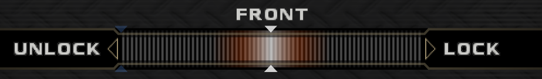
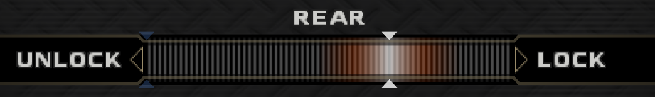
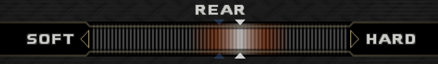
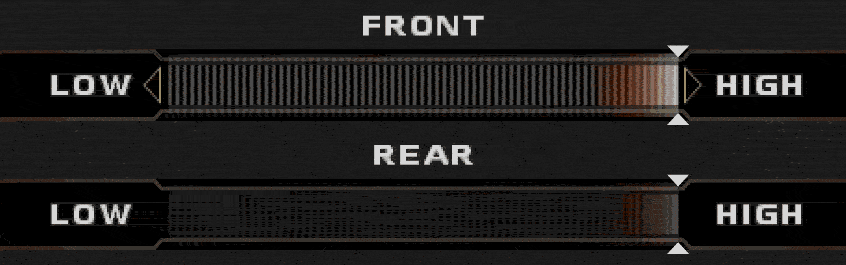
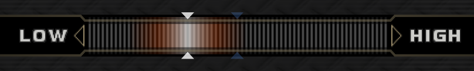

# Enthusia: Professional Racing Quick Tuning Guide

This is a quick guide providing easy-to-remember (not quite "optimal") tuning setups to make cars handle a little nicer. These setups and guidelines are tuned for the NTSC-U version of the game.

## **General**

* Set the ride height of the car **as low as the slider goes on both sides**. This gives cars generally better responsiveness and the ability to recover from slides faster.  
* Some Gentlemen's Agreement (276 HP / 280 PS) cars may need their final drive (gear) set higher or lower for use in King of the Year.  
* If using a car with a CVT, **set the gear ratio all the way to LOW, always**.  
  * The implementation of a CVT is broken in Enthusia, where they seemingly have too high of an upper limit to how long the gear can stretch to, giving cars very high top speeds. Lowering the gear gives these cars more acceleration with minimal or no top-speed loss.  
* Camber in either direction does not seem to help that much for a car's stability or rotation. Too much camber in general also induces instability, no matter what the game says about the car's changes in steering characteristics and on-paper stability.  
* **Enable the VGS**. It will help you diagnose tuning, grip, and/or driving issues.  
  * **Primer**:  
    * The yellow dot represents your current center of gravity. Keep this as close to the middle as you can while turning for stability, throw it around the car to induce slides.  
    * The four tires on the car are represented on the diagram. Tires are dark gray when gripping, and fill with a light gray bar as their grip quota is being used. When a tire is not in contact with the floor or has run out of grip, its border will flash red. Should the grip also be exhausted, the tire's bar will be completely light gray.  
      * The powered wheels of the car will be shown with a thicker gray border than the passive wheels.  
    * The VGS Frame (a moving vignette), if enabled, will show you the car's true direction of travel relative to your field of vision, which can aid in directing slides.  
    * The yellow arrow mode shows the relative lateral G-forces your car is exposed to.  
* **Drive in MT**. Some cars' gearing do not lend themselves well to AT (especially since this game does not let you change individual ratios).  
  * *However, if you are planning on doing an Any% speedrun, **do the first RN race in AT**, due to a weird quirk where if you select AT for a car, the Rest confirmation dialog starts on OK, but starts on BACK if you are in MT.*  
* **Disable ESC and TCS** in the game settings. Neither of these do enough to actually help you in a meaningful way, so they only slow down your lap times for not much gain.

## **FF Cars**

* Set the front and rear ride height to their lowest level.  
* Set the front springs to \~30-50% of the way on the bar.  
* Set the rear dampers to \~70-75% of the way on the bar.  
* Set the differential to be:  
  * \~25% locked if you want stability.  
  * \~80-85% locked if you want extra rotation.  
* No other upgrades have been tested so far, mainly because FFs are generally not viable for King of the Year.  
  * Most of the tuning settings here will likely be only for the Nissan March / Micra and Mini Cooper 1275S Mk. I, the only **GOOD** FWD starter cars.  
  * The eK wagon is still bad, after everything you do to it. We're still not sure what Mitsubishi and Konami were thinking.

## **FR / MR / RR Cars**

* Set the differential to be \~60-75% locked on the rear. This allows the car more rotation before the rear of the car starts sliding out. If needed, increase the differential lock beyond 75% if the car is very unstable (e.g. the Caterham Super Seven, Corvette C3, etc.).it's   
* Set the front spring rate to as hard as it goes. This reduces the lift-off oversteer of the car.  
* Optionally, set the front dampers to as hard as it goes. This further reduces lift-off oversteer, but some cars may not need this (most MRs and RRs, though a few FRs also are stable enough to not require this change).  
  * Some cars benefit from having both the front and rear dampers set to their maximum position for extra responsiveness.  
* If the car still has too much oversteer, another option is to raise the front ride height. This may be necessary on cars such as the Tommy Kaira ZZ-S or Caterham as they are notoriously oversteery.   
* If the car still oversteers too much after all three of the above changes, set the rear toe angle of the car to maximum toe-in as a last resort to induce more understeer at the cost of some acceleration.  
  * **NOTE**: *None of this makes the Shelby Cobra drivable. Trust us, we’ve tried. There’s not much you can do setupwise.*

## **4WD Cars**

* Set the differentials to be 50% locked on the front and \~60-75% locked on the rear. This allows the car to not slide out as much. Some 4WDs will not benefit from this, as it will instead cause them to understeer far more.  
* Optionally, set the rear dampers to be slightly harder to get more oversteer if the car has sluggish handling. This can work on cars like the Estima, but this is usually preference.

# Common Slider Positions / Techniques

## 

Front Differential (\~50%): Aim for the white arrows to be under the 'O' in 'FRONT':

Rear Differential (\~60-75%): Aim for the left side of the gradient’s end to be between where the 'E' and 'A' is in 'REAR', or just slightly to the right of that for closer to 75%:

Rear Dampers for increasing 4WD rotation: Aim for the white arrows to be under the second 'R' in 'REAR':

When adjusting pairs of sliders, one can conserve the movement speed of the sliders by holding onto the left/right direction while pressing up/down:

#  **Car-specific Setups**

## **Honda Beat**

The Honda Beat is one of the cars in the game that requires a bespoke setup: when the car gets upgraded by levelling up, it begins to lift the inner tires when turning (an effect which gets worse the more the car is upgraded, and is also visible on the VGS as the grip bars on the tires flickering), causing the car to fully collapse stability-wise and violently slide out. In order to fix this, apply the generic MR tune, then perform the following:

* Set **both** the front and rear springs to the hardest setting.  
  * This not only fixes the problem, but also gives the car a phenomenal level of responsiveness.  
* Set **both** the front and rear dampers to the hardest setting.  
  * This adds some more responsiveness to the car.  
* Set the gearbox to \~25-35% of the way on the bar.  
  * Most of its power is at its peak and staying in that range is generally far more important than having a bit more top speed. (Unless you want to do a race at Löwenseering with this car, but at that point, what are you even doing?)  
* Set the **rear** differential to \~60-75% of the way on the bar.

The suspension setup above also works for other cars that suffer from the same issue of rapid wheel lifts mid-corner (e.g. Subaru Young).

## **Nissan March / Micra**

The Nissan March appears to be a viable FF car for getting ranks quickly (about the same odds on average as the Beat, but much faster than the beat), though it seems to need a setup to really take advantage of it (setup provided by ImaSiphy ([SRDC](https://www.speedrun.com/users/imasiphy) / [RA](https://retroachievements.org/user/imasiphy))):

* Set **both** the front and rear ride height to their lowest level.  
* Set the **front** springs to \~30-33% of the way on the bar.  
* Set the **rear** dampers to be \~70% of the way on the bar.  
* Set the gearbox to be \~20% of the way on the bar.  
* Set the **front** differential to 80-85% of the way on the bar.  
  * Differentials in Enthusia are realistically simulated, overlocking a differential can induce oversteer. This is what is being done here, in order to make the March / Micra steer a little better.

## **Mini Cooper 1275S Mk. I**

Like the Nissan March / Micra, the classic Mini Cooper appears to be a viable FF car for getting ranks quickly (slightly higher odds on average than the March and Beat, but slightly faster than the Beat), though it seems to need a setup to really take advantage of it (currently, a slight tweak of the March setup by ImaSiphy ([SRDC](https://www.speedrun.com/users/imasiphy) / [RA](https://retroachievements.org/user/imasiphy))):

* Set **both** the front and rear ride height to their lowest level.  
* Set the **front** springs to \~30-33% of the way on the bar.  
* Set the **rear** dampers to be \~70% of the way on the bar.  
* Set the gearbox to be **all the way to the right** on the bar.  
  * This car has very short gears, you will need all this extra top speed once the car's engine gets upgraded.  
* Set the **front** differential to 80-85% of the way on the bar.

# **Known Physics Quirks**

* When two cars get into a collision, the game seems to switch the masses of the 'initiating' car and the 'victim' car. This can cause collisions to feel very irregular, but also means that lightweight cars can push much heavier cars out of the way.  
* Some cars experience an effect where their wheels quickly and repeatedly lift off the ground (visible on the VGS as the tire usage snapping back and forth from full to none without a red border), which gets worse the more the car is upgraded. Set the springs to as hard as they go to work around this.